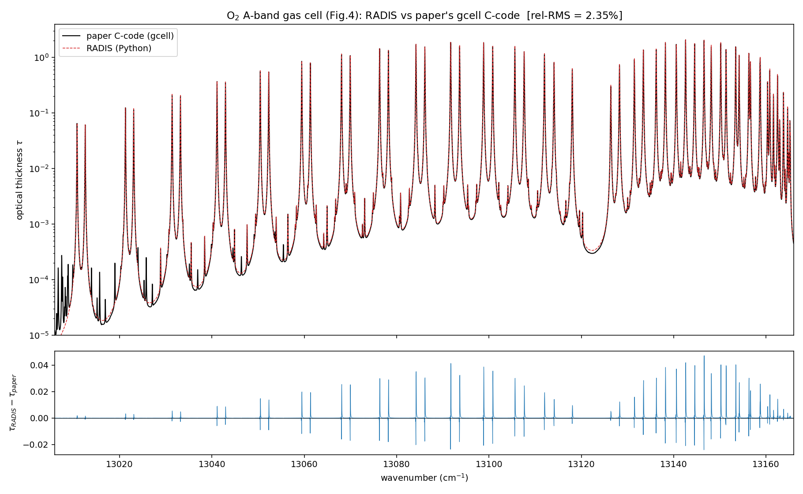

# RADIS vs Korkin et al. (2025) — line-by-line absorption validation

Reproducing the two open-source C codes from

> S. Korkin, A. M. Sayer, A. Ibrahim & A. Lyapustin (2025),
> *"A practical guide to coding line-by-line trace gas absorption in Earth's atmosphere"*,
> **JQSRT 337, 109345**. https://doi.org/10.1016/j.jqsrt.2025.109345

using **[RADIS](https://radis.readthedocs.io/)** (open-source Python line-by-line radiative-transfer
code), and checking the match by overplotting both on the same graph.

The paper ships two codes (reference repo: https://github.com/korkins/aspect_gcell):

| Code | What it does |
|------|--------------|
| `gcell`  | absorption in a homogeneous **gas cell** |
| `aspect` | absorption in **Earth's atmosphere**, with temperature/pressure varying with height |

## Result — it matches

RADIS reproduces both codes **line-by-line**, to within a few percent (the residual is explained by
HITRAN version, line-wing cut-off, and slab discretisation — not a modelling disagreement).

**Gas cell (`gcell`)**

| Test | paper τ_max | RADIS τ_max | rel-RMS |
|------|------------|-------------|---------|
| O₂ A-band (Fig. 4)  | 2.058 | 2.094 | **2.35 %** |
| CH₄ 2.3 µm (Fig. 5) | 6.409 | 6.395 | **7.65 %** |

**Atmosphere (`aspect`, US Standard 1976), reproduced with RADIS's slab-**stack** (`SerialSlabs`)**

| Partial column (TOA → z) | paper τ_max | RADIS τ_max | rel-RMS |
|--------------------------|------------|-------------|---------|
| 0.0 km (full column) | 570.3 | 563.6 | **2.67 %** |
| 1.0 km | 542.0 | 535.0 | 2.75 % |
| 2.5 km | 499.2 | 491.4 | 3.18 % |
| 8.0 km | 339.6 | 329.9 | 4.45 % |

Stacking slabs multiplies transmittances ⇔ adds optical depth. Verified identity:
`max | SerialSlabs(slabs) − Σ(slab optical depths) | = 2.3e-13`, i.e. the stack is exactly aspect's
height integration.



## Repository contents

| File | Description |
|------|-------------|
| `compare_gcell_vs_paper.py` | Runs RADIS for the O₂ & CH₄ gas cells, overplots vs the paper's `gcell` output |
| `compare_aspect_vs_radis_stack.py` | Builds the US1976 atmosphere as a RADIS **slab-stack**, overplots vs `aspect` |
| `reproduce_korkin2025.py` | Earlier stand-alone reproduction of paper Figs. 4 & 5 |
| `make_validation_report.py` / `make_docx_report.py` | Build the PDF / Word reports |
| `figures/` | All overplots (PNG) |
| `RADIS_vs_Korkin2025_Validation_Report.pdf` / `.docx` | Human-readable write-up of method + results |

## How to reproduce

```bash
pip install radis python-docx matplotlib numpy

# get the authors' reference benchmarks (ground truth)
git clone https://github.com/korkins/aspect_gcell
export ASPECT_GCELL="$PWD/aspect_gcell"      # or place the folder next to the scripts

python compare_gcell_vs_paper.py
python compare_aspect_vs_radis_stack.py      # ~2 min: builds & stacks 49 atmospheric slabs
```

Outputs are written to `figures/`.

## Notes

- The US Standard 1976 profile (T, p, density vs height) is taken from the paper's `src/hprofiles.h`.
- The paper's PDF and its extracted text are **not** redistributed here (copyright); see the DOI above.
- Tools: RADIS 0.17, HITRAN, Python 3.11.
